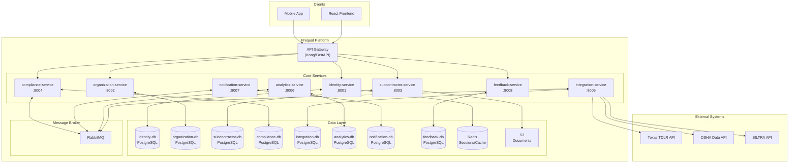
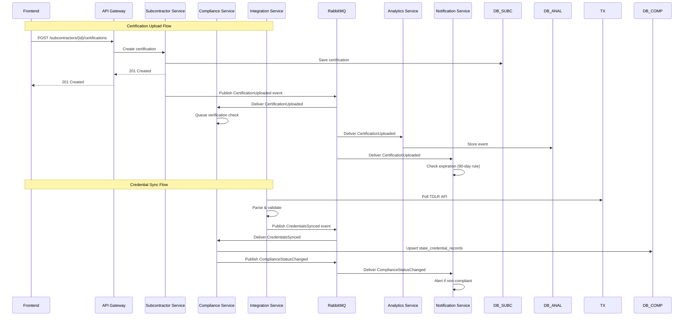
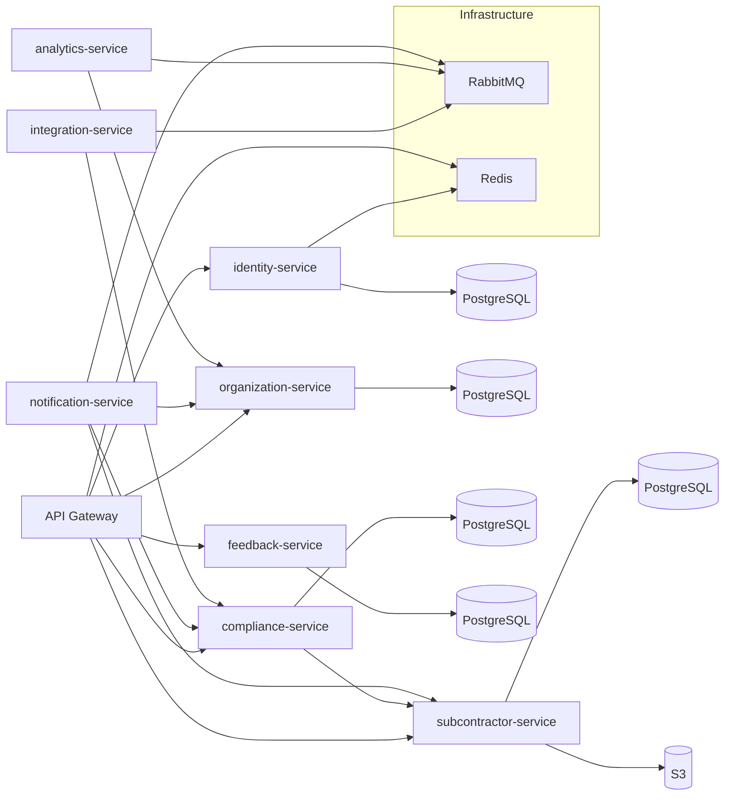
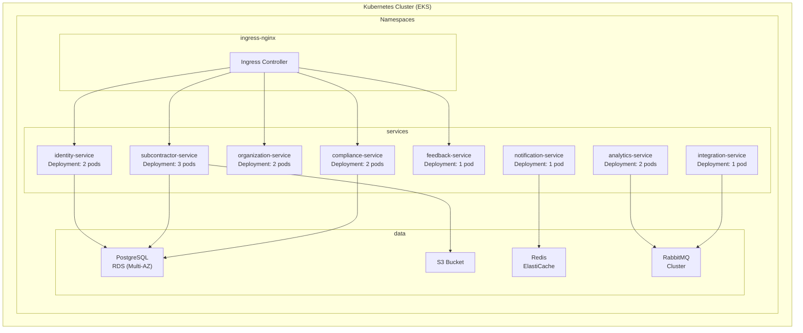
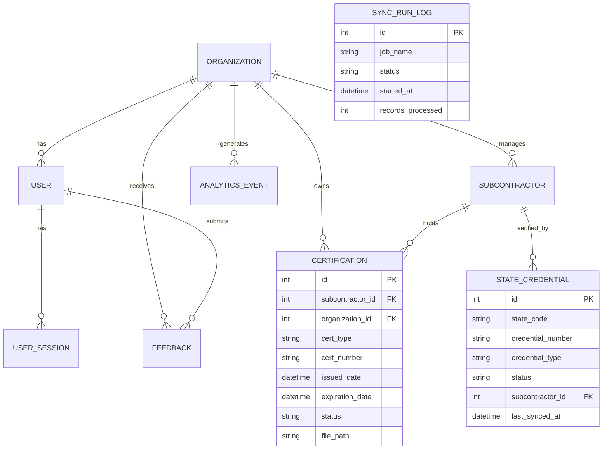

# Prequal Microservice Architecture - Component Diagrams

## 1. System Context Diagram

## 2. Service Interaction Diagram (Async Events)

## 3. Service Dependency Graph

## 4. Deployment Topology

## 5. Database Schema Ownership

## Legend

| Symbol | Meaning |
|--------|---------|
| → | Synchronous REST call |
| ⇒ | Async message (MQ) |
| -- | Database relationship |
| subgraph | Grouped components |
| POD | Kubernetes Deployment |